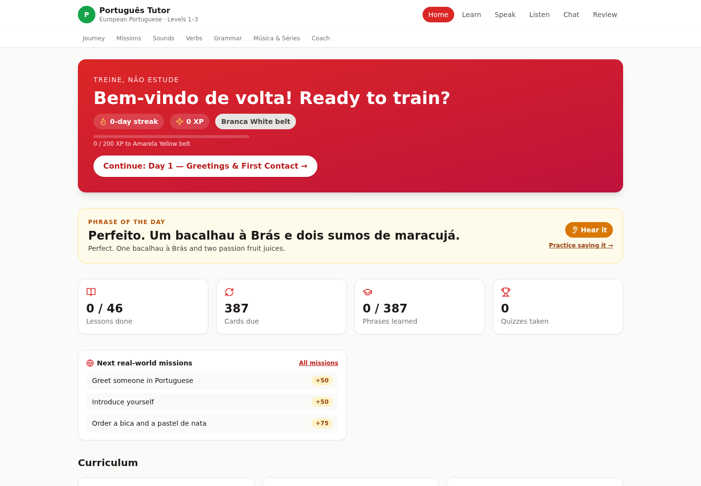
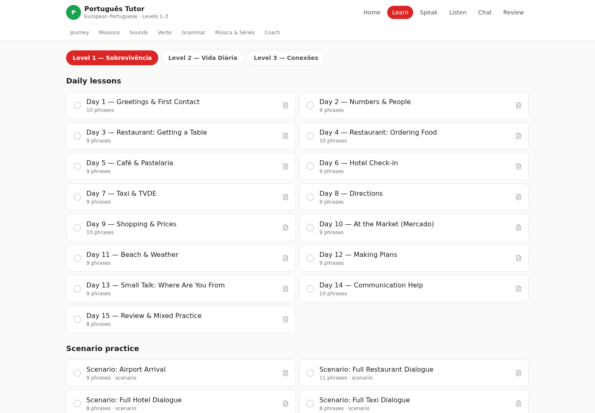
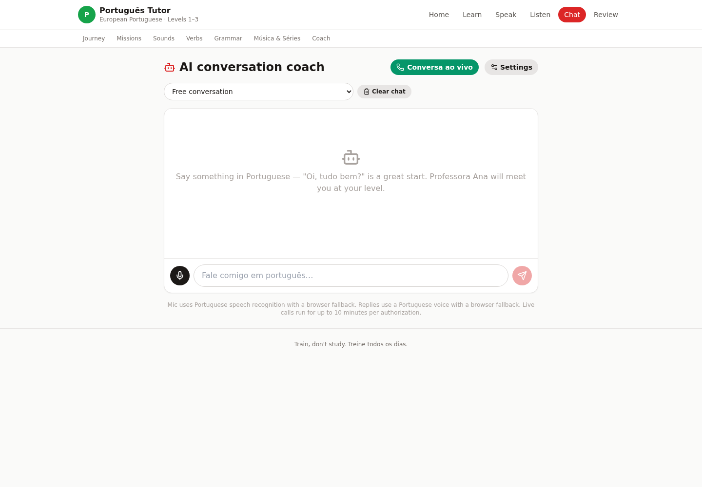
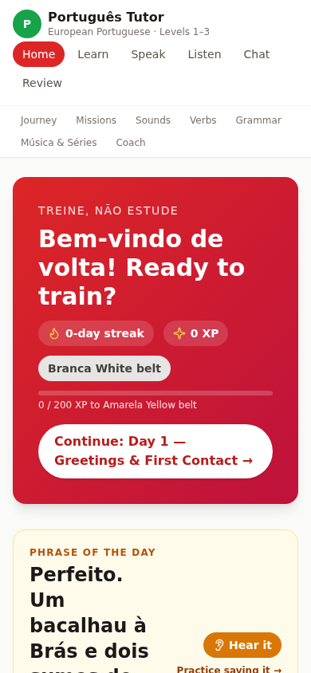

<p align="center">
  
</p>

<h1 align="center">Portuguese Tutor</h1>

<p align="center">
  A self-paced European Portuguese learning app with structured lessons, spaced review,
  pronunciation practice, listening drills, and an AI conversation coach.
</p>

<p align="center">
  <a href="https://portuguese-tutor-marlandoj.zocomputer.io"><strong>Launch the public app</strong></a>
  ·
  <a href="#installation">Install locally</a>
  ·
  <a href="#screenshots">View screenshots</a>
</p>

## What is included

- 46 guided lessons across three levels, from survival Portuguese to connected conversation
- 387 vocabulary and phrase cards with spaced review
- Listening exercises backed by 87 bundled audio recordings
- Speaking practice with transcription and pronunciation scoring
- Scenario-based role-play, quizzes, missions, XP, streaks, and belt progression
- AI text chat and realtime voice coaching with Professora Ana
- Responsive desktop and mobile layouts
- Server-side provider credentials, request validation, concurrency limits, and per-client quotas

## Screenshots

### Learning dashboard



### Curriculum



### AI conversation coach



### Mobile

<p align="center">
  
</p>

## Tech stack

- React 19 and TypeScript
- Vite 7 and Tailwind CSS
- Bun HTTP server
- OpenRouter for AI conversation
- Deepgram for speech transcription
- OpenAI for speech synthesis and realtime voice
- Local browser storage for learner progress
- SQLite-backed server quota accounting

## Installation

### Prerequisites

- [Bun](https://bun.sh/) 1.3 or newer
- Node.js 20 or newer with npm
- Provider keys for the AI or speech capabilities you intend to use

### Set up

```bash
git clone https://github.com/marlandoj/portuguese-tutor.git
cd portuguese-tutor
npm ci
```

Configure provider credentials in your shell. Credentials are read only by the Bun server and are never shipped in the browser bundle.

```bash
export OPENROUTER_API_KEY="your_openrouter_api_key"
export DEEPGRAM_API_KEY="your_deepgram_api_key"
export OPENAI_API_KEY="your_openai_api_key"
```

Build and start the complete application:

```bash
APP_ORIGIN="http://localhost:52243" PORT=52243 npm run prod
```

Open [http://localhost:52243](http://localhost:52243). The curriculum and bundled audio work without provider keys; AI chat, transcription, speech synthesis, and realtime voice require their corresponding provider credentials.

## Development

Install dependencies, then run the Vite client:

```bash
npm run dev
```

The development client runs on port `3000`. Use `npm run prod` when you need the same-origin API server and full AI or speech functionality.

## Commands

| Command | Purpose |
| --- | --- |
| `npm run dev` | Start the Vite development client |
| `npm run build` | Type-check and create the production bundle |
| `npm run lint` | Run ESLint |
| `npm test` | Run the Bun server and security test suite |
| `npm run preview` | Preview the Vite production bundle |
| `npm run prod` | Build and start the production Bun server |

## Architecture

The React client uses hash-based routing so the app works behind a static fallback server. Browser requests to `/api/*` stay same-origin. The Bun server validates payloads and origins, applies quotas and concurrency limits, and forwards only the required request to each provider.

```text
Browser
  ├── React curriculum, progress, and bundled audio
  └── /api/*
        └── Bun validation and quota layer
              ├── OpenRouter
              ├── Deepgram
              └── OpenAI
```

Runtime quota databases and credential files are intentionally excluded from Git.

## Privacy and security

- Provider API keys remain server-side.
- Chat and speech endpoints validate request methods, origins, payload sizes, and supported models.
- Static responses include a restrictive Content Security Policy and related browser security headers.
- Learner progress is stored locally in the browser.
- Do not commit `.runtime`, `.env`, `*.local`, or credential files.

## Deployment

The included `zosite.json` defines the current Zo Site development and production commands. The public deployment is available at:

**https://portuguese-tutor-marlandoj.zocomputer.io**
